# fungi-vision-classifier

## Project Overview
* This project implements a Convolutional Neural Network (CNN) using PyTorch to classify microscopic fungi images into multiple categories.
* The model is trained on the Defungi dataset (downloaded via Kaggle) and performs supervised multi-class image classification.

This project demonstrates:
* Deep learning fundamentals
* Custom CNN architecture design
* Data preprocessing for image tasks
* Training/validation workflow
* Model evaluation using classification metrics
* Visualization of learning curves

## Dataset
Due to size constraints (158MB), the dataset is not included in this repository.

You can download it from:

https://www.kaggle.com/datasets/joebeachcapital/defungi

- Dataset used: Defungi (Microscopic Fungi Image Dataset).
- Downloaded via kagglehub.

### Classes Used

The dataset contains 5 fungal classes:

* H1
* H2
* H3
* H5
* H6

Images are .jpg files organized by class folders.

#### Sample Images from Each Class

| H1 | H2 | H3 | H5 | H6 |
|----|----|----|----|----|
| 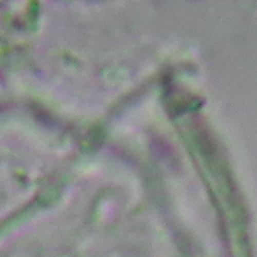 | 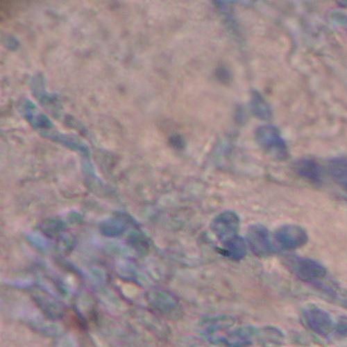 | 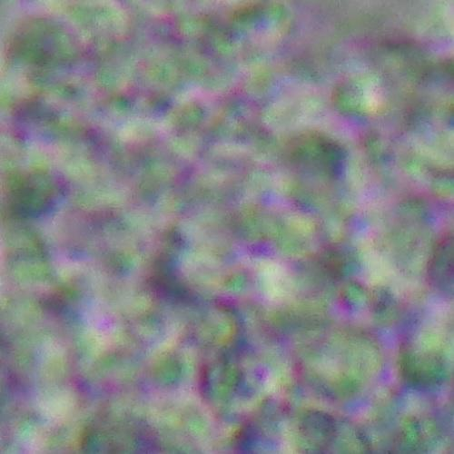 | 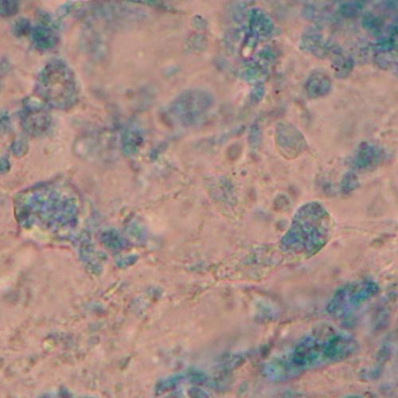 | 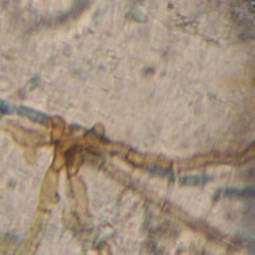   

## Technologies & Libraries

* Python
* PyTorch
* Torchvision
* Scikit-learn
* Matplotlib
* NumPy
* KaggleHub
* tqdm

## Project Pipeline 

### Dataset Download
The dataset is downloaded programmatically using:

- kagglehub.dataset_download("joebeachcapital/defungi")

Kaggle credentials are configured inside the notebook.

### Dataset Splitting
The dataset is manually split into:
- 80% Training
- 20% Testing

| Train-test ratio | 
|------------------|
| 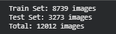 | 

Images are copied into:
- /root/fungi_split/train
- /root/fungi_split/test

Each class is shuffled before splitting to avoid ordering bias.

### Image Preprocessing 
All images undergo the following transformations:
* Resize to 128 × 128
* Convert to tensor
* Normalize to range [-1, 1]

- transforms.Resize((128, 128))
- transforms.ToTensor()
- transforms.Normalize(mean=[0.5, 0.5, 0.5], std=[0.5, 0.5, 0.5])

Batch size: 32

## CNN Architecture

A custom CNN is implemented using nn.Sequential.

### Architecture:
1. Conv2D (3 → 32) + BatchNorm + ReLU + MaxPool
2. Conv2D (32 → 64) + BatchNorm + ReLU + MaxPool
3. Conv2D (64 → 128) + BatchNorm + ReLU + MaxPool
4. Adaptive Average Pooling
5. Fully Connected Layer (128 → 128)
6. Dropout (0.5)
7. Output Layer (128 → num_classes)

#### Key characteristics:
* Uses Batch Normalization
* Uses Dropout for regularization
* Adaptive pooling ensures fixed feature size
* Designed for small-to-medium scale image classification

## Training Configuration
* Loss Function: CrossEntropyLoss
* Optimizer: Adam
* Learning Rate: 0.001
* Epochs: 15
* Device Automatically selects GPU if available

Training loop tracks:
* Training loss
* Validation loss
* Training accuracy
* Validation accuracy

### Training Progress (Epoch Logs)

| Epoch Logs | 
|------------|
| 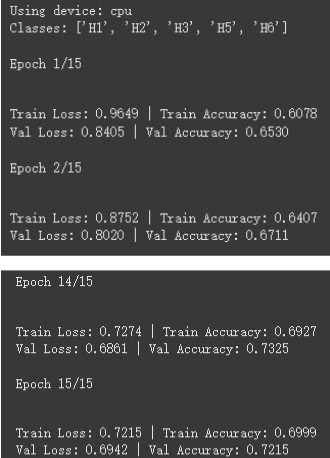 | 

Increase in accuracy from 0.6-0.7 show model is learning from training data. 

## Model Evaluation
After training, the model is evaluated using:
* Confusion Matrix
* Classification Report
  * Precision
  * Recall
  * F1-score
  * Accuracy

Example evaluation tools used:

- confusion_matrix()
- classification_report()

| Confusion Matrix | 
|------------------|
| 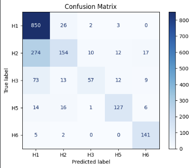 | 

* Model performs well for classes H1, H5, and H6.
* H2 has very low recall due to frequent misclassification as H1.
* H3 balanced but not strong performance. 

| Classification Report | 
|-----------------------|
| 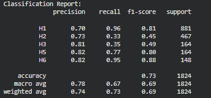 | 

## Training Visualization
Two learning curves are plotted:
* Loss Curve (Train vs Validation)
* Accuracy Curve (Train vs Validation)

| Loss Curve | Accuracy Curve |
|------------| ---------------|
| 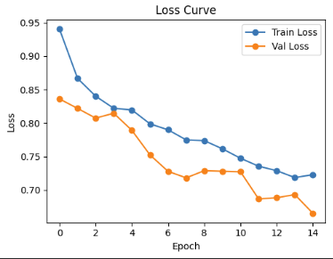 | 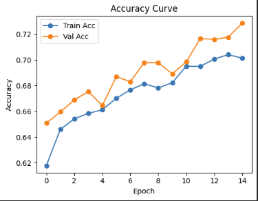 |

Loss Curve: 
* Training loss decreases steadily - effective learning without issues like inappropriate learning rate.
* Validation loss decreases in tandem with training loss - no overfitting, improving on unseen data.
* Both curves plateu at non-zero value - indicates model has reached limits of learning capacity.

Accuracy Curve:
* Validation accuracy stabilizes at 73%, shows generalization ability but hits an early ceiling - suggests underfitting.
* Lower training accuracy imples dataset is difficult to learn from, possibly due to overlapping classes. 

## How to Run This Project

Follow these steps to set up and run the Fungi Vision Classifier project in your Google Colab environment:

### Clone the Repository (Optional, if you want all files)

If you want to clone the entire project repository to your Colab instance, run the following command in a code cell:

!git clone https://github.com/rras1205/fungi-vision-classifier.git
# If you cloned, you might need to navigate into the directory:
# %cd fungi-vision-classifier
Note: The dataset itself will be downloaded directly via kagglehub later in the notebook, so cloning the repository is mainly for getting the project files/structure.

### Install Requirements

Ensure all necessary Python libraries are installed. Most are pre-installed in Colab, but it's good practice to ensure they are available:

!pip install torch torchvision scikit-learn matplotlib kagglehub tqdm
Add Kaggle API Credentials (kaggle.json)

To download the dataset from Kaggle, you need your Kaggle API key:

Download kaggle.json: Go to your Kaggle account settings ([redacted link]) and click 'Create New API Token' to download kaggle.json.
Upload to Colab: In your Colab notebook, use the file upload icon (folder icon on the left panel -> 'Upload to session storage') to upload your kaggle.json file directly to the root of your Colab file system (e.g., /content/).
The notebook contains a cell that will then automatically move this file to the correct ~/.kaggle/ directory and set the appropriate permissions.
Run the Notebook

Once kaggle.json is uploaded and you've installed dependencies, simply run all cells in the notebook sequentially. The notebook will handle the dataset download, splitting, model training, and evaluation.

~/.kaggle/

Then run the notebook

## What this project demonstrates
This project shows:
- Ability to build a CNN from scratch
- Understanding image preprocessing
- Proper training-validation workflow
- Model evaluation beyond just accuracy
- Basic deep learning experimentation

## Limitations
This implementation:
- Uses a simple custom CNN (not pretrained models like ResNet)
- Does not use data augmentation
- Does not perform hyperparameter tuning
- Uses a simple train/test split instead of cross-validation

## Potential Improvements
- Add data augmentation (RandomRotation, RandomHorizontalFlip)
- Implement transfer learning (e.g., ResNet18)
- Continue with more Epochs and Add early stopping
- Save and load trained models
- Deploy as a Streamlit web app

